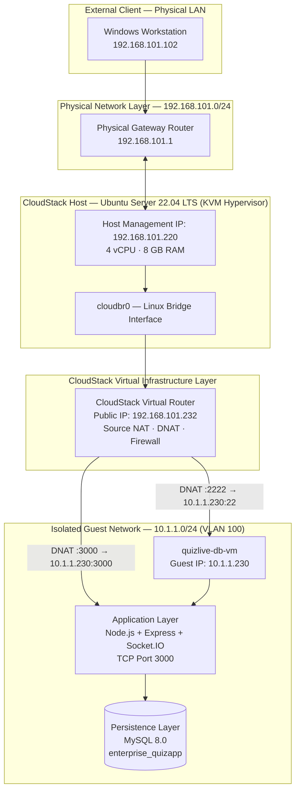
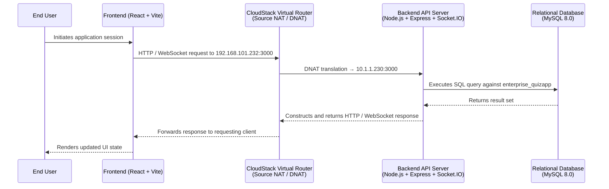
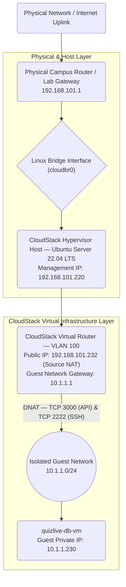

# QuizLive Cloud — Private Cloud Infrastructure as a Service Based on Apache CloudStack and KVM for a Real-Time Interactive Quiz Platform

> **QuizLive Cloud** is a complete implementation of a Private Cloud Infrastructure as a Service (IaaS) environment utilizing **Apache CloudStack 4.18** and the **KVM** hypervisor, deployed on **Ubuntu Server 22.04 LTS** through nested virtualization within VirtualBox. The infrastructure is architected to host **QuizLive** — an enterprise-grade, real-time interactive quiz platform built upon a modern full-stack architecture comprising React + Vite for the presentation layer, Node.js + Express + Socket.IO for the application and communication layers, and MySQL 8.0 as the persistent relational data store.

[](https://nodejs.org/)
[](https://mysql.com/)
[](https://cloudstack.apache.org/)
[](https://www.linux-kvm.org/)
[](https://ubuntu.com/)
[](https://wiki.linux-nfs.org/)
[](https://react.dev/)
[](https://vitejs.dev/)
[](https://expressjs.com/)
[](https://socket.io/)
[](https://pm2.keymetrics.io/)
[](LICENSE)


---

## Preview


---

## Table of Contents

- [Abstract](#abstract)
- [Development Team](#development-team)
- [System Architecture](#system-architecture)
- [IP Address Allocation](#ip-address-allocation)
- [Prerequisites](#prerequisites)
- [Phase 1 — VirtualBox Installation](#phase-1--virtualbox-installation)
- [Phase 2 — Ubuntu Server Installation](#phase-2--ubuntu-server-installation)
- [Phase 3 — Host Network Configuration](#phase-3--host-network-configuration)
- [Phase 4 — Apache CloudStack Installation](#phase-4--apache-cloudstack-installation)
- [Phase 5 — NFS Storage Server Configuration](#phase-5--nfs-storage-server-configuration)
- [Phase 6 — CloudStack Infrastructure Configuration](#phase-6--cloudstack-infrastructure-configuration)
- [Phase 7 — VM Instance Provisioning](#phase-7--vm-instance-provisioning)
- [Phase 8 — VM Configuration via Console Access](#phase-8--vm-configuration-via-console-access)
- [Phase 9 — Backend Application Deployment](#phase-9--backend-application-deployment)
- [Phase 10 — Port Forwarding and Firewall Policy Configuration](#phase-10--port-forwarding-and-firewall-policy-configuration)
- [Phase 11 — Frontend Application Deployment](#phase-11--frontend-application-deployment)
- [Phase 12 — End-to-End System Validation](#phase-12--end-to-end-system-validation)
- [Troubleshooting](#troubleshooting)
- [Command Reference](#command-reference)
- [Repository Structure](#repository-structure)
- [Quick Start](#quick-start)
- [Future Development Roadmap](#future-development-roadmap)
- [License](#license)

---

## Abstract

QuizLive is an interactive real-time quiz platform designed to support computer engineering education environments. The system adopts a cloud-native architecture in which **Apache CloudStack** serves as the local IaaS orchestration layer, managing the complete lifecycle of virtual compute, storage, and network resources. All application components are deployed exclusively within a self-managed, isolated virtual infrastructure provisioned and governed by the CloudStack management server.

**Implementation objectives:**

- Construct an isolated private cloud infrastructure using Apache CloudStack with KVM as the underlying hypervisor.
- Demonstrate the operational application of isolated guest networking, Source Network Address Translation (NAT), and Destination NAT (DNAT) port forwarding within a CloudStack Advanced Zone.
- Deploy a production-grade full-stack application within a fully isolated, non-routable guest network segment.
- Establish secure, controlled public ingress to internal application services via the CloudStack Virtual Router acting as the network perimeter gateway.

---

## Development Team

| Name | Student ID | Role |
|------|------------|------|
| **Daffa Hardhan** | `2306161763` | Ideation Lead & Core Infrastructure Architect |
| **Alexander Christhian** | `2306267025` | Database Administrator & Backend Engineer |
| **Arsinta Kirana Nisa** | `2306215980` | Frontend Developer & UI/UX Designer |
| **Wiellona Darlene Oderia Saragih** | `2306264396` | Frontend Developer & UI/UX Designer |
| **Muhammad Hilmi Al Muttaqi** | `2306267082` | Virtual Network & Security Engineer |
| **Laura Fawzia Sambowo** | `2306260145` | NFS Storage & Virtualization Specialist |
| **Jeremy Wijanarko Mulyono** | `2306267132` | CloudStack Administrator & System Operations |
| **Falah Andhesryo** | `2306161990` | Backend Engineer & VM Deployment Specialist |
| **Achmad Zaidan Lazuardy** | `2206059793` | Technical Writer & Quality Assurance |

**Supervising Lecturer:** Yan Maraden, S.T., M.T., M.Sc.  
**Course:** Cloud Computing  
**Department:** Computer Engineering, Faculty of Engineering, Universitas Indonesia  
**Academic Term:** Even Semester 2025/2026

---

## CloudStack Architecture Diagram


---

## System Architecture

The following diagram illustrates the complete infrastructure topology, delineating the physical LAN layer, the CloudStack host, the CloudStack Virtual Infrastructure layer, and the isolated guest network segment in which the application VM resides.



**Request data flow:**



---

## IP Address Allocation

| Network Segment | Address Range | Assignment Type | Function |
|-----------------|---------------|-----------------|----------|
| Physical LAN — DHCP Pool | `192.168.101.100 – 192.168.101.199` | Dynamic (DHCP) | Client workstations, development hosts, browser-based access |
| CloudStack Host (Hypervisor) | `192.168.101.220` | Static | Ubuntu Server running CloudStack management and KVM agent |
| CloudStack Public IP Pool | `192.168.101.230 – 192.168.101.240` | Static Pool | Virtual Router Public IP: `192.168.101.232` (Source NAT) |
| Isolated Guest Network | `10.1.1.0/24` | Internal (non-routable) | VM application instance: `10.1.1.230`; Virtual Router gateway: `10.1.1.1` |
| Physical Default Gateway | `192.168.101.1` | Fixed | Physical campus/lab router |

**Network Topology Diagram:**



---

## Prerequisites

### Minimum Hardware Requirements

| Component | Specification |
|-----------|---------------|
| Processor | x86_64 architecture with Intel VT-x or AMD-V enabled in BIOS/UEFI firmware |
| System RAM | 12 GB minimum (16 GB or greater recommended) |
| Storage | 150 GB free disk space (SSD strongly recommended for I/O performance) |
| Network Interface | LAN connectivity with internet access |

### Required Software

- VirtualBox 7.0 or later
- Ubuntu Server 22.04 LTS ISO image ([official download](https://releases.ubuntu.com/jammy/ubuntu-22.04.5-live-server-amd64.iso))
- Apache CloudStack 4.18.2.5 packages
- Node.js 20.x LTS
- Git, SSH client, modern web browser

### Hardware Virtualization Verification (Windows Host)

Prior to provisioning the host VM, confirm that hardware-assisted virtualization is exposed to the hypervisor:

```powershell
Get-ComputerInfo | Select-Object HyperVRequirementVirtualizationFirmwareEnabled
```

The expected output is `True`. If `False`, enable the relevant capability in the host system firmware: **Intel VT-x** on Intel platforms, or **AMD SVM** on AMD platforms.

---

## Phase 1 — VirtualBox Installation

### 1.1 Obtain Installation Media

Download the following packages from the official VirtualBox distribution at [virtualbox.org/wiki/Downloads](https://www.virtualbox.org/wiki/Downloads):

- VirtualBox 7.0.x for Windows hosts
- VirtualBox Extension Pack (optional; required for USB 3.0 and remote display support)

### 1.2 Installation Procedure

Execute the installer with administrative privileges. Accept all default settings, acknowledge the temporary network interface reset prompted during installation, and complete the installation wizard.

### 1.3 Extension Pack Installation

Open VirtualBox Manager, navigate to `File → Tools → Extension Pack Manager`, click **Install**, and select the downloaded `.vbox-extpack` file.

### 1.4 Installation Verification

```powershell
VBoxManage --version
```


---

## Phase 2 — Ubuntu Server Installation

### 2.1 Virtual Machine Creation

Open VirtualBox Manager and create a new VM (`Ctrl+N`) with the following parameters:

| Parameter | Value |
|-----------|-------|
| VM Name | `CloudStack-Host` |
| ISO Image | `ubuntu-22.04.5-live-server-amd64.iso` |
| Base Memory | `8192 MB` |
| vCPU Count | `4` |
| Virtual Hard Disk | `100 GB` (VDI format, Dynamically Allocated) |
| Enable EFI | ✅ Enabled |

### 2.2 Dual Network Adapter Configuration

Navigate to `Settings → Network` and configure the following adapters:

| Adapter | Attachment Type | Promiscuous Mode |
|---------|-----------------|------------------|
| Adapter 1 | Bridged Adapter (select physical NIC) | **Allow All** |
| Adapter 2 | NAT | Default |

Promiscuous mode on Adapter 1 is required to allow the CloudStack bridge interface (`cloudbr0`) to receive guest VM traffic across the physical LAN.


### 2.3 Enabling Nested Virtualization

Nested virtualization must be enabled to allow KVM to expose hardware virtualization extensions to guest VMs provisioned by CloudStack. This enables Type-1 hypervisor behavior within the VirtualBox guest environment.

**On the Windows host:**

```powershell
cd "C:\Program Files\Oracle\VirtualBox"
.\VBoxManage modifyvm "CloudStack-Host" --nested-hw-virt on
```

**On the Ubuntu Server host (post-installation):**

```bash
echo "options kvm_intel nested=1" | sudo tee /etc/modprobe.d/kvm.conf
sudo modprobe -r kvm_intel
sudo modprobe kvm_intel nested=1
cat /sys/module/kvm_intel/parameters/nested   # Expected output: Y
```

> **Note:** For AMD-based hosts, substitute `kvm_intel` with `kvm_amd` in the above commands.

### 2.4 Ubuntu Server Operating System Installation

Start the VM and proceed through the Ubuntu Server installation wizard with the following configuration:

| Setting | Value |
|---------|-------|
| Language | English |
| Hostname | `cloudstack-host` |
| Primary User | `ubuntu` |
| Storage Layout | Full disk utilization with LVM |
| OpenSSH Server | ✅ Enabled |

### 2.5 Base System Update and Dependency Installation

Upon first login, perform a full system upgrade and install foundational utilities:

```bash
sudo apt update && sudo apt upgrade -y
sudo apt install -y vim curl wget net-tools bridge-utils \
                    openssh-server git unzip ca-certificates gnupg
```

---

## Phase 3 — Host Network Configuration

This phase establishes the `cloudbr0` Linux bridge interface, which serves as the unified network fabric through which the CloudStack management server, the KVM agent, and all guest VMs communicate with the physical LAN infrastructure.

### 3.1 Network Interface Identification

```bash
ip addr show
```

Record the name of the bridged physical interface (e.g., `enp0s3`).

### 3.2 Bridge Interface Configuration via Netplan

```bash
sudo vim /etc/netplan/00-installer-config.yaml
```

```yaml
network:
  version: 2
  renderer: networkd
  ethernets:
    enp0s3:
      dhcp4: false
  bridges:
    cloudbr0:
      interfaces: [enp0s3]
      addresses: [192.168.101.220/24]
      routes:
        - to: default
          via: 192.168.101.1
          metric: 200
      nameservers:
        addresses: [8.8.8.8, 1.1.1.1]
      parameters:
        stp: false
        forward-delay: 0
```

Disabling Spanning Tree Protocol (STP) and setting `forward-delay: 0` eliminates bridge initialization latency, which is critical for the reliable operation of CloudStack System VM deployments.

### 3.3 Disabling Cloud-Init Network Management

Cloud-init's default DHCP assignment on the physical interface `enp0s3` must be suppressed to prevent address conflicts with the statically configured `cloudbr0` bridge.

```bash
sudo vim /etc/cloud/cloud.cfg.d/99-disable-network-config.cfg
```

```yaml
network: {config: disabled}
```

> **Design rationale:** The repository files `infrastructure/netplan/50-cloud-init.yaml` and `99-nat.yaml` are intentionally disabled. Outbound internet connectivity for both the CloudStack host and guest VMs is provided via `cloudbr0` routing through the physical campus gateway, eliminating the need for secondary NAT configuration and preventing conflicting routing table entries.

### 3.4 Applying Network Configuration

```bash
sudo chmod 600 /etc/netplan/*.yaml
sudo netplan generate
sudo netplan apply

ip addr show cloudbr0
ping -c 3 192.168.101.1
ping -c 3 8.8.8.8
```


---

## Phase 4 — Apache CloudStack Installation

### 4.1 CloudStack Package Repository Configuration

```bash
wget -O - https://download.cloudstack.org/release.asc | sudo apt-key add -

echo "deb https://download.cloudstack.org/ubuntu jammy 4.18" | \
  sudo tee /etc/apt/sources.list.d/cloudstack.list

sudo apt update
```

### 4.2 MySQL Database Server Installation for CloudStack

The CloudStack management server requires a dedicated MySQL instance to persist zone, host, VM, and network configuration state.

```bash
sudo apt install -y mysql-server
sudo vim /etc/mysql/mysql.conf.d/mysqld.cnf
```

Append the following directives under the `[mysqld]` section to satisfy CloudStack's database operational requirements:

```ini
innodb_rollback_on_timeout=1
innodb_lock_wait_timeout=600
max_connections=1000
log-bin=mysql-bin
binlog-format='ROW'
```

```bash
sudo systemctl restart mysql && sudo systemctl enable mysql
```

### 4.3 CloudStack Package Installation

```bash
sudo apt install -y cloudstack-management cloudstack-agent
```

> **Note on slow network environments:** If internet bandwidth is constrained, the `.deb` packages may be downloaded on the Windows host and transferred to the Ubuntu Server via `scp`, then installed using `dpkg -i`.

### 4.4 CloudStack Database Schema Initialization

```bash
sudo cloudstack-setup-databases cloud:cloudpass@localhost \
    --deploy-as=root:rootpassword \
    -i 192.168.101.220
```

This command creates the CloudStack database schema and establishes the management server's operational credentials.

### 4.5 CloudStack Management Server Initialization

```bash
sudo cloudstack-setup-management
```

### 4.6 CloudStack Agent Host Binding Configuration

The CloudStack agent must be bound to the correct management IP to ensure proper communication with the management server:

```bash
sudo vim /etc/cloudstack/agent/agent.properties
```

Verify that the `host` directive is set to the correct management IP address:

```
host=192.168.101.220
```

> **Critical:** Ensure this value is not set to `10.0.3.15` (the NAT interface address) or `localhost`, as either would prevent the agent from registering correctly with the management server.

### 4.7 KVM Hypervisor Verification

```bash
sudo modprobe kvm
sudo modprobe kvm_intel       # Use kvm_amd on AMD-based hosts
lsmod | grep kvm
cat /sys/module/kvm_intel/parameters/nested   # Expected: Y or 1
```

### 4.8 Service Restart and Initialization

```bash
sudo systemctl restart cloudstack-management cloudstack-agent libvirtd
```

### 4.9 CloudStack Management Dashboard Access

```
URL:      http://192.168.101.220:8080/client/
Username: admin
Password: password
```


---

## Phase 5 — NFS Storage Server Configuration

Apache CloudStack requires dedicated primary and secondary storage volumes accessible via NFS. Primary storage holds active VM disk images (volumes), while secondary storage hosts system VM templates, ISO images, and VM snapshots.

### 5.1 NFS Server Package Installation

```bash
sudo apt install -y nfs-kernel-server quota
```

### 5.2 Storage Export Directory Provisioning

```bash
sudo mkdir -p /export/primary /export/secondary
sudo chown -R nobody:nogroup /export
sudo chmod -R 777 /export
```

### 5.3 NFS Export Configuration

```bash
sudo vim /etc/exports
```

```
/export/primary    *(rw,async,no_root_squash,no_subtree_check)
/export/secondary  *(rw,async,no_root_squash,no_subtree_check)
```

The `no_root_squash` option is required to permit CloudStack's storage management operations, which execute as root within guest VMs and the management server.

### 5.4 Export Activation and Service Enablement

```bash
sudo exportfs -a
sudo systemctl restart nfs-kernel-server
sudo systemctl enable nfs-kernel-server
showmount -e localhost
```


### 5.5 CloudStack KVM System VM Template Registration

CloudStack requires a pre-built System VM template in secondary storage to automatically provision System VMs (Secondary Storage VM and Console Proxy VM) during zone initialization:

```bash
sudo /usr/share/cloudstack-common/scripts/storage/secondary/cloud-install-sys-tmplt \
    -m /export/secondary \
    -u http://download.cloudstack.org/systemvm/4.18/systemvmtemplate-4.18.0-kvm.qcow2.bz2 \
    -h kvm \
    -F
```

---

## Phase 6 — CloudStack Infrastructure Configuration

Access the CloudStack management dashboard at `http://192.168.101.220:8080/client/` and proceed through the following infrastructure provisioning steps.

### 6.1 Advanced Zone Creation

Navigate to `Infrastructure → Zones → + Add Zone` and configure the zone as follows:

| Field | Value |
|-------|-------|
| Zone Type | Advanced |
| Zone Name | `QuizServer-Zone` |
| Primary DNS (IPv4) | `8.8.8.8` |
| Internal DNS | `192.168.101.220` |
| Hypervisor Type | KVM |
| Guest CIDR | `10.1.0.0/16` |

**Public IP Address Pool Configuration:**

| Field | Value |
|-------|-------|
| Gateway | `192.168.101.1` |
| Netmask | `255.255.255.0` |
| Start IP | `192.168.101.230` |
| End IP | `192.168.101.240` |

CloudStack will allocate IP addresses from this pool for Virtual Router public interfaces and any Elastic IP assignments within the zone.


### 6.2 Pod, Cluster, and Host Registration

**Pod Configuration:**

| Field | Value |
|-------|-------|
| Pod Name | `Pod-Quiz-1` |
| Reserved IP Gateway | `192.168.101.1` |
| Reserved IP Range | `192.168.101.100 – 192.168.101.150` |

The Pod's reserved IP range is used by CloudStack System VMs and must not overlap with DHCP-assigned or statically configured host addresses.

**Cluster Configuration:**

| Field | Value |
|-------|-------|
| Cluster Name | `KVM-Cluster-1` |
| Hypervisor | KVM |

**Host Registration:**

| Field | Value |
|-------|-------|
| Host IP Address | `192.168.101.220` |
| Username | `root` |
| Password | *(root account password of the Ubuntu Server host)* |

CloudStack communicates with the KVM agent over SSH as root. Root SSH login must be enabled on the hypervisor host prior to host registration:

```bash
sudo passwd root
sudo sed -i 's/#PermitRootLogin.*/PermitRootLogin yes/' /etc/ssh/sshd_config
sudo systemctl restart sshd
```

> **Security consideration:** Root SSH access should be restricted to the management network or disabled and replaced with key-based authentication in production deployments. For this academic implementation, password-based root login is enabled to satisfy CloudStack's default host provisioning requirements.

### 6.3 Primary and Secondary Storage Registration

| Storage Role | NFS Protocol | NFS Server | Export Path |
|--------------|--------------|------------|-------------|
| Primary Storage | NFS | `192.168.101.220` | `/export/primary` |
| Secondary Storage | NFS | `192.168.101.220` | `/export/secondary` |

Upon successful zone completion, click **Launch Zone**. CloudStack will automatically provision the Secondary Storage VM (SSVM) and Console Proxy VM (CPVM) from the previously registered system template. This process typically requires 5–10 minutes.


### 6.4 Ubuntu 22.04 LTS ISO Registration

Navigate to `Images → ISOs → + Register ISO` and complete the registration form:

| Field | Value |
|-------|-------|
| Name | `Ubuntu-22.04-Server` |
| URL | `http://192.168.101.220:8000/ubuntu-22.04.5-live-server-amd64.iso` |
| Zone | `QuizServer-Zone` |
| Bootable | ✅ Enabled |
| OS Type | Ubuntu 22.04 LTS |

**ISO Distribution Procedure (LAN-local serving):**

Direct ISO download from an internet source is unreliable in constrained or isolated lab environments, as SSVM download timeouts and DNS instability may cause repeated registration failures. The recommended procedure is to serve the ISO from the CloudStack host itself over the local area network:

```powershell
# On the Windows workstation: transfer ISO to the Ubuntu Server host
scp ubuntu-22.04.5-live-server-amd64.iso ubuntu@192.168.101.220:~/iso/
```

```bash
# On the Ubuntu Server / CloudStack host: serve ISO via Python HTTP server
cd ~/iso
python3 -m http.server 8000 --bind 192.168.101.220
```

Register the ISO using the following LAN-local URL, which the SSVM will retrieve at substantially higher throughput than an external internet source:

```
http://192.168.101.220:8000/ubuntu-22.04.5-live-server-amd64.iso
```

Monitor ISO status from `Images → ISOs` until it transitions from `Not Ready` to `Ready`.


### 6.5 Compute Service Offering Configuration

Compute offerings define the virtual hardware profile — vCPU count, clock allocation, and memory — assigned to provisioned VM instances.

Navigate to `Service Offerings → Compute Offerings → + Add` to register the following offerings:

**Standard Offerings (Global):**

| Offering Name | Display Text | vCPU | CPU MHz | Memory | Scope |
|---------------|--------------|------|---------|--------|-------|
| `Small Instance` | Small Instance | `1` | `500` | `512 MB` | Global |
| `Medium Instance` | Medium Instance | `1` | `1000` | `1024 MB` | Global |

**QuizLive-Specific Offerings:**

| Offering Name | Intended Workload | vCPU | CPU MHz | Memory | Local Storage | Zone |
|---------------|-------------------|------|---------|--------|---------------|------|
| `quizlivesmall` | Lightweight stateless services: API gateway, bastion host, microservices | `1` | `1000` | `512 MB` | `10 GB SSD` | `QuizServer-Zone` |
| `quizlivemedium` | Relational database workloads (MySQL 8.0), transactional processing, moderate concurrency | `1` | `1000` | `1024 MB` | `20 GB SSD` | `QuizServer-Zone` |

**Detailed Offering Comparison:**

| Parameter | `quizlivesmall` | `quizlivemedium` |
|-----------|-----------------|------------------|
| vCPU Cores | `1` | `1` |
| CPU Frequency | `1000 MHz` | `1000 MHz` |
| Memory | `512 MB` | `1024 MB` |
| Local Storage | `10 GB SSD` | `20 GB SSD` |
| Thin Provisioning | Enabled | Enabled |
| Zone Scope | `QuizServer-Zone` | `QuizServer-Zone` |

The `quizlivemedium` offering is selected for the combined application and database VM `quizlive-db-vm`.

> **Architecture note:** The `quizlivesmall` offering was originally designed for a dedicated stateless API gateway instance. However, due to the resource constraints inherent in a nested virtualization environment (host RAM: 24 GB), and the observed instability caused by running multiple concurrent VMs under CloudStack nested virtualization, the decision was made to consolidate both the API server and the MySQL database onto a single `quizlive-db-vm` instance using the `quizlivemedium` offering. This consolidation ensures deployment stability throughout demo and end-to-end testing cycles.


### 6.6 Isolated Guest Network Provisioning

Navigate to `Network → Guest Networks → + Add Network` and configure the isolated network as follows:

| Field | Value |
|-------|-------|
| Network Name | `QuizLive-Isolated-OK` |
| Network Offering | `DefaultIsolatedNetworkOfferingWithSourceNatService` |
| Guest Gateway | `10.1.1.1` |
| Guest Netmask | `255.255.255.0` |
| VLAN Assignment | `100` (automatically assigned) |

Upon network creation, CloudStack automatically provisions a Virtual Router VM and assigns it the public IP address `192.168.101.232` from the zone's public IP pool. This Virtual Router performs Source NAT for all outbound traffic originating from the `10.1.1.0/24` isolated guest subnet, and serves as the sole ingress gateway for inbound DNAT port forwarding rules.


---

## Phase 7 — VM Instance Provisioning

Navigate to `Compute → Instances → + Add Instance` and configure the deployment parameters as follows:

| Step | Parameter | Value |
|------|-----------|-------|
| Setup | Zone | `QuizServer-Zone` |
| | Template / ISO | ISO → `Ubuntu-22.04-Server` |
| Compute Offering | Selection | `quizlivemedium` |
| Network | Guest Network | `QuizLive-Isolated-OK` |
| Advanced | Instance Name | `quizlive-db-vm` |

Click **Launch Instance** and await VM provisioning. Status will transition to `Running` within approximately 3–5 minutes.

**Post-provisioning NIC verification:**

| Parameter | Expected Value |
|-----------|----------------|
| Guest IPv4 Address | `10.1.1.230` |
| Network | `QuizLive-Isolated-OK` |
| Guest Gateway | `10.1.1.1` |


---

## Phase 8 — VM Configuration via Console Access

Because `quizlive-db-vm` resides within the isolated `10.1.1.0/24` network — which is non-routable from the physical LAN — all initial configuration must be performed via the embedded VNC console provided by the CloudStack Console Proxy VM (CPVM).

### 8.1 Accessing the VNC Console

From the CloudStack dashboard, click the `quizlive-db-vm` instance entry, then click **View Console**. The Console Proxy VM opens a VNC session to the guest VM within the browser, allowing full keyboard and display interaction through the CloudStack management plane.


### 8.2 Ubuntu Server Guest Installation

Complete the Ubuntu Server installation wizard within the VNC console session using the following parameters:

| Setting | Value |
|---------|-------|
| Hostname | `quizlive-db-vm` |
| Primary User | `quizlive-db` |
| Network Configuration | Automatic (DHCP via Virtual Router): `10.1.1.x/24`, gateway `10.1.1.1`, DNS `8.8.8.8` |
| Storage Layout | Full disk with LVM |
| OpenSSH Server | ✅ Enabled |

### 8.3 System Update and Dependency Installation

```bash
sudo apt update && sudo apt upgrade -y
sudo apt install -y curl wget vim git build-essential ca-certificates gnupg
```

### 8.4 Node.js 20.x LTS Installation

```bash
curl -fsSL https://deb.nodesource.com/setup_20.x | sudo -E bash -
sudo apt install -y nodejs
node -v && npm -v
```

### 8.5 MySQL 8.0 Server Installation

```bash
sudo apt install -y mysql-server
sudo systemctl enable --now mysql
sudo mysql_secure_installation
```


---

## Phase 9 — Backend Application Deployment

### 9.1 Database and Application User Provisioning

```bash
sudo mysql -u root -p
```

```sql
-- Database creation with Unicode support
CREATE DATABASE enterprise_quizapp
    CHARACTER SET utf8mb4
    COLLATE utf8mb4_unicode_ci;

-- Application user accounts with principle of least privilege
CREATE USER 'quiz_api_worker'@'localhost' IDENTIFIED BY 'CompEng!QuizSecured@2026';
CREATE USER 'quiz_api_worker'@'%'         IDENTIFIED BY 'CompEng!QuizSecured@2026';

-- Privilege grant: localhost (full DML + DDL for migrations)
GRANT SELECT, INSERT, UPDATE, DELETE, EXECUTE, CREATE, ALTER, INDEX, DROP, REFERENCES
    ON enterprise_quizapp.* TO 'quiz_api_worker'@'localhost';

-- Privilege grant: remote (restricted to DML operations only)
GRANT SELECT, INSERT, UPDATE, DELETE, EXECUTE
    ON enterprise_quizapp.* TO 'quiz_api_worker'@'%';

FLUSH PRIVILEGES;
EXIT;
```

### 9.2 MySQL Remote Connections (Optional)

To permit remote connections to the MySQL instance (e.g., for external administration tools):

```bash
sudo sed -i 's/bind-address.*/bind-address = 0.0.0.0/' /etc/mysql/mysql.conf.d/mysqld.cnf
sudo systemctl restart mysql
```

### 9.3 Repository Cloning and Dependency Installation

```bash
cd ~
git clone https://github.com/DHard4114/CloudStack-5.git
cd CloudStack-5/compeng-quiz-api
npm install
```

### 9.4 Environment Variable Configuration

```bash
cp .env.example .env
vim .env
```

```env
PORT=3000
NODE_ENV=production

DB_HOST=localhost
DB_PORT=3306
DB_USER=quiz_api_worker
DB_PASSWORD=CompEng!QuizSecured@2026
DB_NAME=enterprise_quizapp
DB_CONNECTION_LIMIT=20

JWT_SECRET=rahasiabanget2026gantidenganstringrandompanjang
JWT_EXPIRES_IN=24h
BCRYPT_ROUNDS=12
```

> **Security note:** In production deployments, the `JWT_SECRET` value must be replaced with a cryptographically random string of sufficient entropy (minimum 256 bits). The value shown above is a development placeholder and must not be used in any externally accessible environment.

### 9.5 Database Schema Initialization

```bash
mysql -u quiz_api_worker -p enterprise_quizapp < src/database/quizapp.sql
```

### 9.6 Process Management via PM2

PM2 (Process Manager 2) is deployed as the Node.js process supervisor, providing automatic process restart on failure, persistent startup configuration, and centralized log aggregation.

```bash
sudo npm install -g pm2

pm2 start src/app.js --name quizlive-api
pm2 save
pm2 startup systemd
# Execute the sudo command printed by pm2 startup to register the systemd unit

pm2 list
pm2 logs quizlive-api --lines 20
```


### 9.7 Local API Endpoint Verification

```bash
curl http://localhost:3000/health
# Expected: {"success":true,"service":"CompEng Quiz API","version":"1.0.0","env":"production"}
```

---

## Phase 10 — Port Forwarding and Firewall Policy Configuration

Inbound access to the application VM from the physical LAN is established through two mechanisms on the CloudStack Virtual Router:

1. **Firewall Rules** — permit inbound TCP traffic on specified ports at the Virtual Router's public IP interface.
2. **Port Forwarding (DNAT) Rules** — translate destination port numbers from the public interface to the guest VM's private IP and port.

### 10.1 Firewall Ingress Rules

Navigate to `Network → Public IP Addresses → 192.168.101.232 → Firewall` and create the following ingress policies:

| Source CIDR | Protocol | Start Port | End Port | Purpose |
|-------------|----------|------------|----------|---------|
| `0.0.0.0/0` | TCP | `3000` | `3000` | Application API and WebSocket access |
| `0.0.0.0/0` | TCP | `2222` | `2222` | SSH administrative access to guest VM |


### 10.2 DNAT Port Forwarding Rules

Navigate to `Network → Public IP Addresses → 192.168.101.232 → Port Forwarding` and create the following DNAT translation rules:

| Public Port | Private Port | Protocol | Target Instance | Guest Private IP |
|-------------|--------------|----------|-----------------|------------------|
| `3000` | `3000` | TCP | `quizlive-db-vm` | `10.1.1.230` |
| `2222` | `22` | TCP | `quizlive-db-vm` | `10.1.1.230` |


> **Port 2222 design rationale:** The standard SSH port (TCP 22) on the public IP `192.168.101.232` would conflict with the CloudStack host's SSH service, as the same public IP is shared with the host system's management interface in this configuration. Mapping SSH access to the guest VM through the alternate port `2222` eliminates this conflict and allows independent SSH sessions to both the CloudStack host (port 22 directly via `192.168.101.220`) and the guest VM (port 2222 via `192.168.101.232`).

### 10.3 Guest VM Host-Based Firewall (Defense-in-Depth)

As an additional layer of access control within the guest VM itself, UFW may be configured to enforce host-level ingress filtering independent of the Virtual Router's perimeter firewall:

```bash
sudo ufw allow 22/tcp
sudo ufw allow 3000/tcp
sudo ufw --force enable
sudo ufw status verbose
```

### 10.4 Connectivity Verification from Windows Workstation

```powershell
# Verify API endpoint reachability
curl http://192.168.101.232:3000/health

# Verify SSH access via DNAT
ssh quizlive-db@192.168.101.232 -p 2222

# Verify WebSocket transport availability
curl http://192.168.101.232:3000/socket.io/
# Expected: {"code":0,"message":"Transport unknown"}
```


---

## Phase 11 — Frontend Application Deployment

The React + Vite frontend is served from the Windows workstation in development mode, communicating with the backend API through the CloudStack Virtual Router's public IP.

```bash
git clone https://github.com/DHard4114/CloudStack-5.git
cd CloudStack-5/compeng-quiz-fe

cp .env.example .env
# Configure environment variables:
# VITE_API_URL=http://192.168.101.232:3000
# VITE_SOCKET_URL=http://192.168.101.232:3000

npm run dev
```

Access the application at **http://localhost:5173**.

**Production Build (Optional):**

```bash
npm run build
npm run preview
```


---

## Phase 12 — End-to-End System Validation

System validation is performed under two concurrent user roles:

- **Administrator / Educator** — operates the management dashboard from a laptop to create accounts, author quiz content, manage sessions, monitor real-time scoring, and terminate sessions.
- **Participant / Student** — accesses the platform from a mobile device on the same LAN to join sessions via access code, submit answers, and view leaderboard results.

### 12.1 Administrator Account Registration

The administrator creates an educator account through the registration interface.


| Parameter | Value |
|-----------|-------|
| Role | Administrator / Educator |
| Operation | Account registration |
| Expected Outcome | Account successfully created and operable for authentication |

### 12.2 Administrator Authentication

The administrator authenticates using the previously registered credentials.


| Parameter | Value |
|-----------|-------|
| Role | Administrator / Educator |
| Operation | Authentication / Login |
| Expected Outcome | Administrator successfully redirected to the QuizLive management dashboard |

### 12.3 Quiz Content Creation

The administrator creates a new quiz from the dashboard.


| Parameter | Value |
|-----------|-------|
| Role | Administrator / Educator |
| Operation | Quiz creation |
| Expected Outcome | New quiz persisted to the database and visible in the quiz management listing |

### 12.4 Question and Response Option Authoring

The administrator adds questions, multiple-choice answer options, and designates correct responses.


| Parameter | Value |
|-----------|-------|
| Role | Administrator / Educator |
| Operation | Question authoring |
| Expected Outcome | Questions saved and associated with the quiz, ready for session deployment |

### 12.5 Quiz Session Initiation

The administrator opens a quiz session, generating a unique join code / PIN for participant entry.


| Parameter | Value |
|-----------|-------|
| Role | Administrator / Educator |
| Operation | Session creation |
| Expected Outcome | Session join code / PIN generated and displayed for participant distribution |

### 12.6 Participant Mobile Client Session Entry

Participants navigate to the application from a mobile device, enter the session join code / PIN, and provide a display name.


| Parameter | Value |
|-----------|-------|
| Role | Participant / Student |
| Device | Mobile device |
| Operation | Session join via access code |
| Expected Outcome | Participant successfully enters the waiting room; presence reflected in administrator lobby view |

### 12.7 Quiz Session Start

After all participants have joined, the administrator initiates the quiz session.


| Parameter | Value |
|-----------|-------|
| Role | Administrator / Educator |
| Operation | Session start |
| Expected Outcome | First question distributed to all connected participants via Socket.IO real-time events |

### 12.8 Participant Answer Submission

Participants submit answers from their mobile devices. Answer payloads are transmitted to the backend API via HTTP POST, with real-time state updates propagated to all connected clients via Socket.IO events.


| Parameter | Value |
|-----------|-------|
| Role | Participant / Student |
| Operation | Answer submission |
| Expected Outcome | Answer recorded in the database; game state updated and propagated via Socket.IO |

### 12.9 Real-Time Score and Leaderboard Updates

Both the administrator and participants can observe live score updates and leaderboard rankings as answers are processed.


| Parameter | Value |
|-----------|-------|
| Role | Administrator / Educator and Participant / Student |
| Operation | Score update observation |
| Expected Outcome | Scores and leaderboard rankings updated in real time via Socket.IO broadcast events |

### 12.10 Session Termination

The administrator concludes the quiz session upon completion of all questions.


| Parameter | Value |
|-----------|-------|
| Role | Administrator / Educator |
| Operation | Session termination |
| Expected Outcome | Session marked as complete; final results accessible to all participants |

---

### End-to-End Test Scenario Summary

| # | Test Scenario | API Endpoint / Mechanism | Status |
|---|---------------|--------------------------|--------|
| 1 | Educator account registration | `POST /api/auth/register` | ✅ Pass |
| 2 | Educator authentication | `POST /api/auth/login` | ✅ Pass |
| 3 | Quiz creation | `POST /api/quizzes` | ✅ Pass |
| 4 | Question authoring | `POST /api/quizzes/:uuid/questions` | ✅ Pass |
| 5 | Session creation and join code generation | `POST /api/sessions` | ✅ Pass |
| 6 | Participant session join via mobile client | Frontend → session code entry | ✅ Pass |
| 7 | Quiz session start | `POST /api/sessions/:uuid/start` | ✅ Pass |
| 8 | Participant answer submission | `POST /api/sessions/:uuid/answer` | ✅ Pass |
| 9 | Real-time leaderboard update | Socket.IO broadcast event | ✅ Pass |
| 10 | Session termination | `POST /api/sessions/:uuid/end` | ✅ Pass |

### Network Connectivity Validation

```bash
ping 192.168.101.232
curl http://192.168.101.232:3000/health
curl http://192.168.101.232:3000/socket.io/
ssh quizlive-db@192.168.101.232 -p 2222
```

### PM2 Process Resilience Validation

```bash
pm2 stop quizlive-api      # Simulate process failure
pm2 start quizlive-api     # Validate manual recovery
sudo reboot                # Validate systemd auto-start on host restart
pm2 list                   # Expected status: online
```

---

## Troubleshooting

<details>
<summary><b>Error: <code>Incorrect arguments to mysqld_stmt_execute</code></b></summary>

**Root Cause:**
A SQL prepared statement contains a mismatch between the number of positional placeholder parameters (`?`) and the number of bound argument values passed at execution time, causing the MySQL server to reject the statement.

**Technical Explanation:**
This error typically manifests in `session.repository.js` or `gameSocket.js` within the `INSERT INTO participant_answers` statement, where a column was added or removed from the schema without updating the corresponding parameterized query.

**Resolution Procedure:**
1. Identify the affected prepared statement in the relevant source file.
2. Count and reconcile the number of `?` placeholders with the number of bound parameters.
3. Commit the fix to the repository.
4. On the guest VM, pull the corrected code and restart the application process:

```bash
cd ~/CloudStack-5/compeng-quiz-api
git pull
pm2 restart quizlive-api
```

**Verification Step:**
```bash
pm2 logs quizlive-api --lines 30
curl http://localhost:3000/health
```

</details>

<details>
<summary><b>SSH to Guest VM — Connection Timeout</b></summary>

**Root Cause:**
Direct SSH to the guest VM's private IP (`10.1.1.x`) is not possible from the physical LAN because the isolated guest network (`10.1.1.0/24`) is a non-routable, RFC 1918-private segment with no direct L3 path to the physical LAN subnet (`192.168.101.0/24`). Traffic must traverse the CloudStack Virtual Router via DNAT port forwarding.

**Technical Explanation:**
CloudStack Advanced Zones with isolated networks use VLAN segmentation and the Virtual Router as the sole inter-network transit point. No routing advertisement is made from the guest subnet to the physical LAN, ensuring strict tenant isolation.

**Resolution Procedure:**
Always connect to the guest VM via the Virtual Router's public IP using the mapped SSH port:

```powershell
ssh quizlive-db@192.168.101.232 -p 2222
```

**Verification Step:**
Confirm the port forwarding rule for `2222 → 10.1.1.230:22` is active in `Network → Public IP Addresses → 192.168.101.232 → Port Forwarding`.

</details>

<details>
<summary><b>Mixed Content Error (HTTPS Frontend → HTTP Backend)</b></summary>

**Root Cause:**
Modern browsers enforce the Mixed Content security policy, which blocks active mixed content (e.g., HTTP API requests or WebSocket connections) initiated from an HTTPS-served page. When the frontend is served over HTTPS and the backend is accessible only over HTTP, all outbound requests are blocked by the browser at the transport layer.

**Technical Explanation:**
The browser's Mixed Content blocking is enforced at the origin level and cannot be bypassed through CORS headers or application-level configuration, as it is a client-side security control.

**Resolution Procedure:**
Select one of the following approaches based on the operational context:

Option A — Run the frontend locally over HTTP (development mode):
```bash
npm run dev
# Access at http://localhost:5173
```

Option B — Expose the backend over HTTPS using Cloudflare Tunnel:
```bash
cloudflared tunnel --url http://192.168.101.232:3000
```

Option C — Expose the backend over HTTPS using Ngrok:
```bash
ngrok http 192.168.101.232:3000
```

**Verification Step:**
Open the browser developer tools (`F12 → Console`) and confirm the absence of Mixed Content warnings after applying the selected resolution.

</details>

<details>
<summary><b>ISO Registration Status Remains <code>Not Ready</code></b></summary>

**Root Cause:**
The SSVM (Secondary Storage VM) is responsible for downloading and caching registered ISO images. Direct download from an internet URL may fail due to: (1) insufficient internet bandwidth causing SSVM download timeouts, (2) intermittent DNS resolution failures within the CloudStack network namespace, or (3) instability in the internet uplink from the lab environment.

**Technical Explanation:**
CloudStack's SSVM initiates ISO downloads as a background task. If the download does not complete within the internal timeout window, or if the NFS write operation is interrupted, the ISO status will remain `Not Ready` indefinitely until the registration is retried.

**Resolution Procedure:**
Serve the ISO from the CloudStack host itself over the local area network to eliminate internet dependency:

1. Download the ISO on the Windows workstation.

2. Transfer the ISO to the CloudStack host:
```powershell
scp ubuntu-22.04.5-live-server-amd64.iso ubuntu@192.168.101.220:~/iso/
```

3. Launch a local HTTP file server on the CloudStack host:
```bash
cd ~/iso
python3 -m http.server 8000 --bind 192.168.101.220
```

4. Re-register the ISO using the LAN-local URL:
```
http://192.168.101.220:8000/ubuntu-22.04.5-live-server-amd64.iso
```

5. Monitor ISO status until it transitions to `Ready`.

**Verification Step:**
If the status remains `Not Ready` after 10 minutes, reboot the SSVM from `Infrastructure → System VMs → SSVM → Reboot`, then re-register the ISO using the same LAN-local URL.

</details>

<details>
<summary><b>Guest VM Cannot Reach Internet</b></summary>

**Root Cause:**
Outbound internet connectivity for the guest VM is provided exclusively through the CloudStack Virtual Router via Source NAT. If the Virtual Router is in a degraded or non-operational state, all outbound NAT translations will fail and the guest VM will lose internet access.

**Resolution Procedure:**

1. Verify Virtual Router operational status in `Infrastructure → Virtual Routers`. Confirm state is `Running`.
2. If the Virtual Router is in a degraded state, initiate a reboot from `Infrastructure → Virtual Routers → Reboot`.
3. If DNS resolution is failing within the guest VM, configure static nameservers in the guest Netplan configuration:

```yaml
nameservers:
  addresses: [8.8.8.8, 1.1.1.1]
```

**Verification Step:**
```bash
ping -c 3 8.8.8.8        # ICMP reachability
ping -c 3 google.com      # DNS resolution + ICMP
curl http://ifconfig.me   # Outbound NAT validation
```

</details>

<details>
<summary><b>CloudStack Agent — Connection Refused</b></summary>

**Root Cause:**
The CloudStack agent (`cloudstack-agent`) is bound to an incorrect host IP address in its properties file, preventing the management server from establishing the control-plane connection required for VM lifecycle operations.

**Technical Explanation:**
The agent's `host` property must match the IP address on which the management server is listening — specifically, the `cloudbr0` bridge interface address. If the agent is configured with the NAT interface address (`10.0.3.15`) or `localhost`, the management server cannot route requests to the agent.

**Resolution Procedure:**
```bash
sudo cat /etc/cloudstack/agent/agent.properties | grep ^host=
# Expected: host=192.168.101.220

# If incorrect, update the file:
sudo vim /etc/cloudstack/agent/agent.properties
# Set: host=192.168.101.220

sudo systemctl restart libvirtd cloudstack-agent
```

**Verification Step:**
```bash
sudo tail -100 /var/log/cloudstack/agent/agent.log | grep -E "Connected|ERROR|WARN"
```

The log should show a successful connection to the management server without repeated reconnection attempts.

</details>

<details>
<summary><b>Port 3000 Not Accessible from External Hosts</b></summary>

**Root Cause:**
Failure to reach the application API on port 3000 from external hosts can result from any of several independent failure points across the infrastructure stack.

**Diagnostic Checklist:**

- [ ] **PM2 process status:** Is the `quizlive-api` process in `online` state?
  ```bash
  pm2 list
  ```
- [ ] **Application bind address:** Is the Node.js server listening on `0.0.0.0` (all interfaces) rather than `127.0.0.1` (loopback only)?
  ```bash
  sudo ss -tlnp | grep 3000
  ```
- [ ] **Guest VM host-based firewall:** Is UFW permitting inbound TCP on port 3000?
  ```bash
  sudo ufw status
  ```
- [ ] **CloudStack firewall rule:** Is there an active firewall ingress rule permitting TCP 3000 on the Virtual Router public IP `192.168.101.232`?
- [ ] **CloudStack DNAT rule:** Is there an active port forwarding rule mapping `192.168.101.232:3000 → 10.1.1.230:3000`?

**Verification Step:**
After resolving the identified failure point:
```bash
curl http://192.168.101.232:3000/health
```

</details>

<details>
<summary><b>CORS Policy Violation</b></summary>

**Root Cause:**
The browser's Cross-Origin Resource Sharing (CORS) enforcement blocks API requests when the response does not include the appropriate `Access-Control-Allow-Origin` header matching the requesting origin. This occurs when the backend CORS middleware is not configured to permit the frontend's origin.

**Resolution Procedure:**
Add or update the CORS middleware configuration in the backend application entry point:

```javascript
import cors from 'cors';

app.use(cors({
  origin: [
    'http://localhost:5173',
    'http://192.168.101.102:5173'
  ],
  credentials: true,
}));
```

After updating the configuration, restart the application process:
```bash
pm2 restart quizlive-api
```

**Verification Step:**
Open the browser developer tools (`F12 → Network`), re-attempt the failing request, and confirm that the response includes the `Access-Control-Allow-Origin` header with a value matching the requesting origin.

</details>

<details>
<summary><b>Nested Virtualization Not Enabled</b></summary>

**Root Cause:**
KVM's ability to provision hardware-accelerated guest VMs requires that Intel VT-x or AMD-V virtualization extensions be visible within the VirtualBox guest environment. By default, VirtualBox does not expose these extensions to guest VMs.

**Resolution Procedure:**

On the Windows host (VirtualBox must be closed):
```powershell
VBoxManage modifyvm "CloudStack-Host" --nested-hw-virt on
```

On the Ubuntu Server host:
```bash
echo "options kvm_intel nested=1" | sudo tee /etc/modprobe.d/kvm.conf
sudo modprobe -r kvm_intel
sudo modprobe kvm_intel nested=1
```

**Verification Step:**
```bash
cat /sys/module/kvm_intel/parameters/nested
# Expected output: Y
```

</details>

<details>
<summary><b>System VM (SSVM / CPVM) Stuck in Starting State</b></summary>

**Root Cause:**
CloudStack System VMs (Secondary Storage VM and Console Proxy VM) may enter a persistent `Starting` state due to resource contention, NFS mount failures, or KVM provisioning errors during zone initialization or after a host restart.

**Resolution Procedure:**
Destroy the affected System VM from `Infrastructure → System VMs → [VM Name] → Destroy`. CloudStack will automatically re-provision a replacement System VM within approximately 5 minutes using the registered system template.

**Diagnostic Log Inspection:**
```bash
sudo tail -100 /var/log/cloudstack/management/management-server.log | grep -i ssvm
```

**Verification Step:**
Monitor `Infrastructure → System VMs` until the replacement System VM reaches `Running` state and all associated services (NFS mount, SSH connectivity) are confirmed operational by the management server.

</details>

---

## Command Reference

### CloudStack Host (Ubuntu Server)

```bash
# CloudStack service management
sudo systemctl status cloudstack-management
sudo systemctl restart cloudstack-management
sudo systemctl status cloudstack-agent
sudo systemctl restart cloudstack-agent

# Log monitoring
sudo tail -f /var/log/cloudstack/management/management-server.log
sudo tail -f /var/log/cloudstack/agent/agent.log

# KVM hypervisor operations
sudo virsh list --all
sudo virsh dominfo <vm-name>
sudo virsh console <vm-name>

# NFS storage verification
showmount -e localhost
sudo systemctl status nfs-kernel-server

# Network diagnostics
ip addr show
sudo brctl show
sudo iptables -t nat -L
```

### Guest VM — Backend Application

```bash
# PM2 process management
pm2 list
pm2 logs quizlive-api
pm2 restart quizlive-api
pm2 monit

# Application code update
cd ~/CloudStack-5/compeng-quiz-api
git pull origin main
npm install
pm2 restart quizlive-api

# MySQL database operations
mysql -u quiz_api_worker -p enterprise_quizapp
mysqldump -u quiz_api_worker -p enterprise_quizapp > backup.sql

# Network and service diagnostics
curl http://localhost:3000/health
sudo ss -tlnp | grep 3000
```

### Windows Workstation

```powershell
# API endpoint reachability test
curl http://192.168.101.232:3000/health

# SSH to guest VM via DNAT
ssh quizlive-db@192.168.101.232 -p 2222

# Secure file transfer to guest VM via DNAT
scp -P 2222 <local-file> quizlive-db@192.168.101.232:~/

# VirtualBox VM management
VBoxManage list vms
VBoxManage startvm "CloudStack-Host" --type headless
```

---

## Repository Structure

```text
QuizLive-CloudStack/
├── README.md
├── LICENSE
├── infrastructure/
│   ├── netplan/                       # Netplan YAML configurations
│   ├── cloudstack/                    # CloudStack configuration artifacts
│   └── nfs/                           # NFS export configuration
├── compeng-quiz-api/                  # Backend: Node.js + Express + Socket.IO
│   ├── src/
│   │   └── database/
│   │       └── quizapp.sql            # Database schema and seed data
│   ├── package.json
│   └── .env.example
└── compeng-quiz-fe/                   # Frontend: React + Vite
    ├── src/
    ├── package.json
    └── .env.example
```

---

## Quick Start

For environments where the CloudStack infrastructure is already provisioned and operational, the application stack can be deployed using the following abbreviated procedure.

**Backend Deployment (on the guest VM):**

```bash
git clone https://github.com/DHard4114/CloudStack-5.git
cd CloudStack-5/compeng-quiz-api
npm install
cp .env.example .env
# Configure DB credentials and JWT secret in .env
mysql -u quiz_api_worker -p enterprise_quizapp < src/database/quizapp.sql
pm2 start src/app.js --name quizlive-api
pm2 save
```

**Frontend Deployment (on the Windows workstation):**

```bash
git clone https://github.com/DHard4114/CloudStack-5.git
cd CloudStack-5/compeng-quiz-fe
npm install
cp .env.example .env
# Set VITE_API_URL and VITE_SOCKET_URL to http://192.168.101.232:3000
npm run dev
```

**Service Access Points:**

| Service | URL |
|---------|-----|
| Frontend Application | `http://localhost:5173` |
| Backend REST API | `http://192.168.101.232:3000` |
| CloudStack Management Dashboard | `http://192.168.101.220:8080/client/` |

---

## Future Development Roadmap

### Reverse Proxy and Public Accessibility via Cloudflare Tunnel

Expose the application over a publicly routable HTTPS domain without modifying firewall or NAT rules on the physical network:

```bash
sudo dpkg -i cloudflared-linux-amd64.deb
cloudflared tunnel login
cloudflared tunnel create quizlive-tunnel
cloudflared tunnel route dns quizlive-tunnel api.quizlive.example.com
```

### High Availability Infrastructure

- Secondary CloudStack management server with HAProxy load balancing for management plane redundancy.
- MySQL Galera Cluster for the CloudStack database, providing synchronous multi-master replication.
- Keepalived with a Virtual IP for management server failover without manual intervention.

### Application-Layer Auto-Scaling

- Create a reusable VM template from the provisioned `quizlive-db-vm` instance.
- Define a CloudStack Auto Scale Policy: automatically provision additional API VMs when average CPU utilization exceeds 70%.
- Deploy HAProxy as the load balancer in front of the auto-scaled API VM pool.

### Multi-Tenant Resource Isolation

- Leverage CloudStack Projects to enforce per-course or per-classroom resource boundaries.
- Define independent vCPU, RAM, and storage quotas for each project, enabling true multi-tenant operation within the shared infrastructure.

---

## License

MIT License — © 2026 Daffa Hardhan & QuizLive Team
Department of Electrical Engineering, Faculty of Engineering, Universitas Indonesia

---

## References

[Apache CloudStack Documentation](http://docs.cloudstack.apache.org/) · [Ubuntu Server Guide](https://ubuntu.com/server/docs) · [Socket.IO Documentation](https://socket.io/docs/v4/) · [React Documentation](https://react.dev/) · [Vite Documentation](https://vitejs.dev/) · [PM2 Documentation](https://pm2.keymetrics.io/docs/)