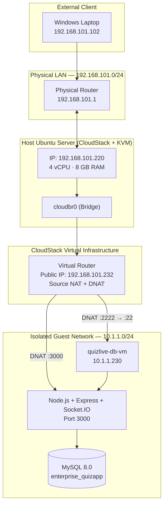
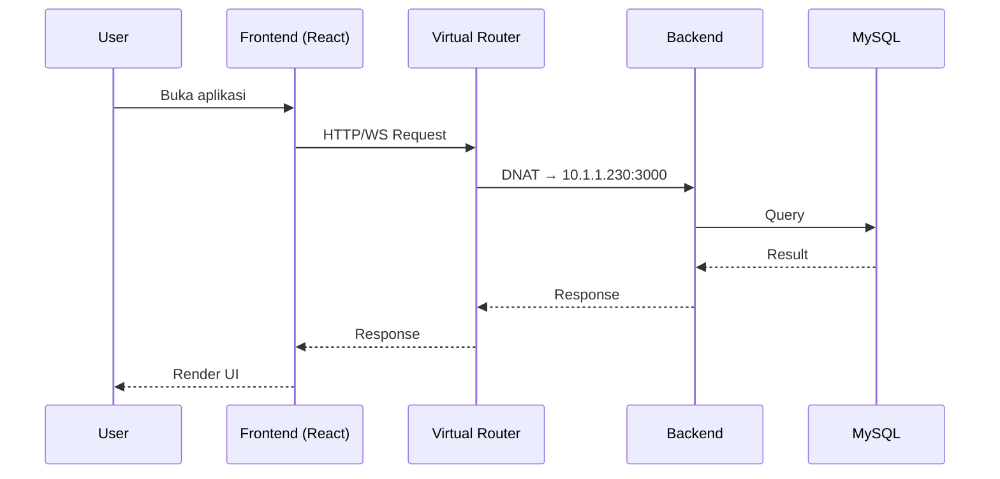

# QuizLive — Real-Time Engineering Challenge Platform

> Platform kuis interaktif real-time berbasis cloud privat, dibangun di atas **Apache CloudStack + KVM** sebagai simulasi enterprise data center. Tugas akhir mata kuliah **Komputasi Awan**, Teknik Komputer, Universitas Indonesia.

[](https://nodejs.org/)
[](https://mysql.com/)
[](https://cloudstack.apache.org/)
[](https://www.linux-kvm.org/)
[](https://ubuntu.com/)
[](https://wiki.linux-nfs.org/)
[](https://react.dev/)
[](https://vitejs.dev/)
[](https://expressjs.com/)
[](https://socket.io/)
[](https://pm2.keymetrics.io/)
[](LICENSE)


---

## Daftar Isi

- [Pendahuluan](#pendahuluan)
- [Tim Pengembang](#tim-pengembang)
- [Arsitektur Sistem](#arsitektur-sistem)
- [Alokasi IP Address](#alokasi-ip-address)
- [Prerequisites](#prerequisites)
- [Phase 1 — Instalasi VirtualBox](#phase-1--instalasi-virtualbox)
- [Phase 2 — Instalasi Ubuntu Server](#phase-2--instalasi-ubuntu-server)
- [Phase 3 — Konfigurasi Network Host](#phase-3--konfigurasi-network-host)
- [Phase 4 — Instalasi Apache CloudStack](#phase-4--instalasi-apache-cloudstack)
- [Phase 5 — Konfigurasi NFS Server](#phase-5--konfigurasi-nfs-server)
- [Phase 6 — Konfigurasi Infrastruktur CloudStack](#phase-6--konfigurasi-infrastruktur-cloudstack)
- [Phase 7 — Deploy VM Instance](#phase-7--deploy-vm-instance)
- [Phase 8 — Konfigurasi VM via View Console](#phase-8--konfigurasi-vm-via-view-console)
- [Phase 9 — Deployment Backend](#phase-9--deployment-backend)
- [Phase 10 — Port Forwarding & Firewall](#phase-10--port-forwarding--firewall)
- [Phase 11 — Deployment Frontend](#phase-11--deployment-frontend)
- [Phase 12 — Pengujian End-to-End](#phase-12--pengujian-end-to-end)
- [Troubleshooting](#troubleshooting)
- [Command Reference](#command-reference)
- [Struktur Repository](#struktur-repository)
- [Quick Start](#quick-start)
- [Pengembangan Lanjutan](#pengembangan-lanjutan)
- [Lisensi](#lisensi)

---

## Pendahuluan

QuizLive adalah platform kuis interaktif yang dirancang untuk mendukung pembelajaran di lingkungan Teknik Komputer. Sistem mengadopsi arsitektur cloud-native dengan **Apache CloudStack** sebagai IaaS lokal, di mana seluruh komponen aplikasi di-deploy di atas infrastruktur virtual yang dikelola mandiri.

**Tujuan implementasi:**

- Membangun infrastruktur cloud privat terisolasi dengan CloudStack
- Menerapkan konsep isolated network, Source NAT, dan port forwarding
- Mendeploy aplikasi full-stack di lingkungan terisolasi
- Menjamin akses publik dari frontend ke backend via Virtual Router

---

## Tim Pengembang

| Nama | NPM | Peran |
|------|-----|-------|
| **Daffa Hardhan** | `2306161763` | Cloud Architect & Backend Lead |
| **[Nama Anggota 2]** | `2106XXXXXX` | Frontend & UI/UX |
| **[Nama Anggota 3]** | `2106XXXXXX` | DevOps & Infrastructure |
| **[Nama Anggota 4]** | `2106XXXXXX` | Database & API Engineer |

**Dosen Pengampu:** Yan Maraden, S.T., M.T., M.Sc
**Mata Kuliah:** Komputasi Awan
**Program Studi:** Teknik Komputer, Fakultas Teknik, Universitas Indonesia
**Semester:** Genap 2025/2026

---
## Diagram Cloudstack


## Arsitektur Sistem



**Alur data sederhana:**



---

## Alokasi IP Address

| Segment | Range | Tipe | Fungsi |
|---------|-------|------|--------|
| LAN Windows Host (DHCP) | `192.168.101.100 – .199` | Dinamis | Laptop host, browser, frontend dev |
| Host Hypervisor | `192.168.101.220` | Statis | Ubuntu Server (CloudStack) |
| CloudStack Public IP Pool | `192.168.101.230 – .240` | Pool | Virtual Router: `.232` (Source NAT) |
| Isolated Guest Network | `10.1.1.0/24` | Internal | VM backend: `10.1.1.230` |
| Gateway LAN | `192.168.101.1` | Fixed | Default gateway fisik |


---

## Prerequisites

**Hardware minimum:**

| Komponen | Spesifikasi |
|----------|-------------|
| Processor | x86_64 dengan VT-x / AMD-V enabled di BIOS |
| RAM | 12 GB (rekomendasi 16 GB+) |
| Storage | 150 GB free (rekomendasi SSD) |
| Network | LAN dengan akses internet |

**Software yang harus disiapkan:**

- VirtualBox 7.0+
- Ubuntu Server 22.04 LTS ISO ([download](https://ubuntu.com/download/server))
- CloudStack 4.18.2.5 packages
- Node.js 20.x LTS
- Git, SSH client, web browser

**Verifikasi virtualisasi Windows:**

```powershell
Get-ComputerInfo | Select-Object HyperVRequirementVirtualizationFirmwareEnabled
```

Output harus `True`. Jika `False`, enable di BIOS (Intel: VT-x, AMD: SVM).

---

## Phase 1 — Instalasi VirtualBox

**1.1 Download**

Unduh dari [virtualbox.org/wiki/Downloads](https://www.virtualbox.org/wiki/Downloads):

- VirtualBox 7.0.x untuk Windows hosts
- VirtualBox Extension Pack (opsional)

**1.2 Instalasi**

Jalankan installer sebagai Administrator. Klik Next pada semua dialog, setujui reset network interface, klik Finish.

**1.3 Install Extension Pack**

Buka VirtualBox Manager → `File → Tools → Extension Pack Manager` → Install → pilih file `.vbox-extpack`.

**1.4 Verifikasi**

```powershell
VBoxManage --version
```


---

## Phase 2 — Instalasi Ubuntu Server

**2.1 Buat VM**

VirtualBox Manager → New (Ctrl+N):

| Parameter | Value |
|-----------|-------|
| Name | `CloudStack-Host` |
| ISO Image | `ubuntu-22.04.5-live-server-amd64.iso` |
| Base Memory | `8192 MB` |
| Processors | `4 CPU` |
| Hard Disk | `100 GB` (VDI, Dynamically allocated) |
| Enable EFI | ✅ |

**2.2 Konfigurasi Network Adapter Dual**

Settings → Network:

| Adapter | Type | Promiscuous Mode |
|---------|------|------------------|
| Adapter 1 | Bridged Adapter (pilih interface fisik) | **Allow All** |
| Adapter 2 | NAT | Default |


**2.3 Enable Nested Virtualization**

```powershell
cd "C:\Program Files\Oracle\VirtualBox"
.\VBoxManage modifyvm "CloudStack-Host" --nested-hw-virt on

echo "options kvm_intel nested=1" | sudo tee /etc/modprobe.d/kvm.conf
sudo modprobe -r kvm_intel
sudo modprobe kvm_intel nested=1
cat /sys/module/kvm_intel/parameters/nested # harus Y 
```

**2.4 Instalasi Ubuntu**

Start VM, ikuti wizard:

- Language: English
- Server name: `cloudstack-host`
- Username: `ubuntu`
- Storage: Use entire disk + LVM
- ✅ Install OpenSSH server

**2.5 Update sistem**

```bash
sudo apt update && sudo apt upgrade -y
sudo apt install -y vim curl wget net-tools bridge-utils \
                    openssh-server git unzip ca-certificates gnupg
```

---

## Phase 3 — Konfigurasi Network Host

**3.1 Identifikasi interface**

```bash
ip addr show
```

Catat nama interface bridged (mis. `enp0s3`) dan NAT (mis. `enp0s8`).

**3.2 Konfigurasi bridge**

```bash
sudo vim /etc/netplan/00-installer-config.yaml
```

```yaml
network:
  version: 2
  renderer: networkd
  ethernets:
    enp0s3:
      dhcp4: false
      dhcp6: false
  bridges:
    cloudbr0:
      interfaces: [enp0s3]
      addresses: [192.168.101.220/24]
      routes:
        - to: default
          via: 192.168.101.1
          metric: 200
      nameservers:
        addresses: [8.8.8.8, 1.1.1.1]
      parameters:
        stp: false
        forward-delay: 0
```

**3.3 Konfigurasi NAT untuk internet VM**

```bash
sudo vim /etc/netplan/99-nat.yaml
```

```yaml
network:
  version: 2
  ethernets:
    enp0s8:
      dhcp4: true
      routes:
        - to: default
          via: 10.0.3.2
          metric: 100
```

> Metric 100 (NAT) lebih rendah dari 200 (bridged) sehingga traffic internet keluar via NAT, sedangkan traffic LAN tetap via `cloudbr0`.

**3.4 Apply**

```bash
sudo chmod 600 /etc/netplan/*.yaml
sudo netplan generate
sudo netplan apply

ip addr show cloudbr0
ping -c 3 192.168.101.1
ping -c 3 8.8.8.8
```


---

## Phase 4 — Instalasi Apache CloudStack

**4.1 Tambah repository**

```bash
wget -O - https://download.cloudstack.org/release.asc | sudo apt-key add -

echo "deb https://download.cloudstack.org/ubuntu jammy 4.18" | \
  sudo tee /etc/apt/sources.list.d/cloudstack.list

sudo apt update
```

**4.2 Install MySQL untuk database CloudStack**

```bash
sudo apt install -y mysql-server
sudo vim /etc/mysql/mysql.conf.d/mysqld.cnf
```

Tambahkan di section `[mysqld]`:

```ini
innodb_rollback_on_timeout=1
innodb_lock_wait_timeout=600
max_connections=1000
log-bin=mysql-bin
binlog-format='ROW'
```

```bash
sudo systemctl restart mysql && sudo systemctl enable mysql
```

**4.3 Install CloudStack**

```bash
sudo apt install -y cloudstack-management cloudstack-agent
```

jika koneksi internet lambat, dapat mengunduh file .deb dari Windows lalu install menggunakan dpkg -i.

**4.4 Setup database CloudStack**

```bash
sudo cloudstack-setup-databases cloud:cloudpass@localhost \
    --deploy-as=root:rootpassword \
    -i 192.168.101.220
```

**4.5 Setup management server**

```bash
sudo cloudstack-setup-management
```

**4.6 Konfigurasi agent**

```bash
sudo vim /etc/cloudstack/agent/agent.properties
```

Pastikan `host=192.168.101.220` (bukan `10.0.3.15` atau `localhost`).

**4.7 Verifikasi KVM**

```bash
sudo modprobe kvm
sudo modprobe kvm_intel  # atau kvm_amd
lsmod | grep kvm
cat /sys/module/kvm_intel/parameters/nested  # Expected: Y atau 1
```

**4.8 Restart services**

```bash
sudo systemctl restart cloudstack-management cloudstack-agent libvirtd
```

**4.9 Akses dashboard**

```
http://192.168.101.220:8080/client/
Default login: admin / password
```


---

## Phase 5 — Konfigurasi NFS Server

**5.1 Install NFS**

```bash
sudo apt install -y nfs-kernel-server quota
```

**5.2 Buat direktori storage**

```bash
sudo mkdir -p /export/primary /export/secondary
sudo chown -R nobody:nogroup /export
sudo chmod -R 777 /export
```

**5.3 Konfigurasi exports**

```bash
sudo vim /etc/exports
```

```
/export/primary    *(rw,async,no_root_squash,no_subtree_check)
/export/secondary  *(rw,async,no_root_squash,no_subtree_check)
```

**5.4 Apply**

```bash
sudo exportfs -a
sudo systemctl restart nfs-kernel-server
sudo systemctl enable nfs-kernel-server
showmount -e localhost
```


**5.5 Download System VM Template**

```bash
sudo /usr/share/cloudstack-common/scripts/storage/secondary/cloud-install-sys-tmplt -m /export/secondary -u http://download.cloudstack.org/systemvm/4.18/systemvmtemplate-4.18.0-kvm.qcow2.bz2 -h kvm -F
```

---

## Phase 6 — Konfigurasi Infrastruktur CloudStack

Login ke dashboard `http://192.168.101.220:8080/client/`.

### 6.1 Membuat Advanced Zone

`Infrastructure → Zones → + Add Zone`

| Field | Value |
|-------|-------|
| Zone Type | Advanced |
| Name | `QuizServer-Zone` |
| IPv4 DNS1 | `8.8.8.8` |
| Internal DNS1 | `192.168.101.220` |
| Hypervisor | KVM |
| Guest CIDR | `10.1.0.0/16` |

**Public IP Range:**

| Field | Value |
|-------|-------|
| Gateway | `192.168.101.1` |
| Netmask | `255.255.255.0` |
| Start IP | `192.168.101.230` |
| End IP | `192.168.101.240` |


### 6.2 Pod, Cluster, Host

**Pod:**

| Field | Value |
|-------|-------|
| Name | `Pod-Quiz-1` |
| Gateway | `192.168.101.1` |
| Reserved IP range | `192.168.101.100 – .150` |

**Cluster:**

| Field | Value |
|-------|-------|
| Name | `KVM-Cluster-1` |
| Hypervisor | KVM |

**Host:**

| Field | Value |
|-------|-------|
| Host IP | `192.168.101.220` |
| Username | `root` |
| Password | *(root password host)* |

Pastikan SSH root enabled:

```bash
sudo passwd root
sudo sed -i 's/#PermitRootLogin.*/PermitRootLogin yes/' /etc/ssh/sshd_config
sudo systemctl restart sshd
```

### 6.3 Primary & Secondary Storage

| Storage | Protocol | Server | Path |
|---------|----------|--------|------|
| Primary | SharedMountPoint | `192.168.101.220` | `/var/lib/libvirt/images` |
| Secondary | NFS | `192.168.101.220` | `/export/secondary` |

Setelah Zone berhasil dibuat → **Launch Zone** → tunggu System VM (SSVM, CPVM) deploy otomatis (~5–10 menit).


### 6.4 Register ISO Ubuntu 22.04

`Images → ISOs → + Register ISO`

| Field | Value |
|-------|-------|
| Name | `Ubuntu-22.04-Server` |
| URL | `http://releases.ubuntu.com/22.04/ubuntu-22.04.5-live-server-amd64.iso` |
| Zone | `QuizServer-Zone` |
| Bootable | ✅ |
| OS Type | Ubuntu 22.04 LTS |

> Jika koneksi internet VM lambat, salin ISO ke `/export/secondary/iso/` dan gunakan URL `file:///export/secondary/iso/ubuntu-22.04.5-live-server-amd64.iso`.

Tunggu status berubah dari `Not Ready` → `Ready`.


### 6.5 Compute Offering Custom

`Service Offerings → Compute Offerings → + Add`

| Field | Value |
|-------|-------|
| Name | `quizlivemedium` |
| CPU Cores | `1` |
| CPU MHz | `1000` |
| Memory | `1024 MB` |
| Network Rate | `200 Mbps` |
| Storage Type | Local |


### 6.6 Isolated Guest Network

`Network → Guest Networks → + Add Network`

| Field | Value |
|-------|-------|
| Name | `QuizLive-Isolated-OK` |
| Network Offering | `DefaultIsolatedNetworkOfferingWithSourceNatService` |
| Gateway | `10.1.1.1` |
| Netmask | `255.255.255.0` |
| VLAN | `100` (auto) |

Virtual Router otomatis ter-deploy dengan Public IP `192.168.101.232` (Source NAT).


---

## Phase 7 — Deploy VM Instance

`Compute → Instances → + Add Instance`

| Step | Field | Value |
|------|-------|-------|
| Setup | Zone | `QuizServer-Zone` |
| | Template/ISO | ISO → `Ubuntu-22.04-Server` |
| Compute Offering | Choose | `quizlivemedium` |
| Networks | Select | `QuizLive-Isolated-OK` |
| Advanced | Name | `quizlive-db-vm` |

Launch Instance → tunggu ~3–5 menit hingga status `Running`.

Verifikasi NICs:
- IPv4: `10.1.1.230`
- Network: `QuizLive-Isolated-OK`
- Gateway: `10.1.1.1`


---

## Phase 8 — Konfigurasi VM via View Console

VM berada di isolated network sehingga akses awal harus via **View Console** (VNC embedded di dashboard).

**8.1 Buka console**

Klik instance `quizlive-db-vm` → klik **View Console** → window VNC terbuka → ikuti wizard installer Ubuntu.


**8.2 Instalasi Ubuntu**

| Setting | Value |
|---------|-------|
| Hostname | `quizlive-db-vm` |
| Username | `ubuntu` |
| Network | Automatic (DHCP): `10.1.1.x/24`, gateway `10.1.1.1`, DNS `8.8.8.8` |
| Storage | Use entire disk + LVM |
| OpenSSH | ✅ |

**8.3 Update & install dependencies**

```bash
sudo apt update && sudo apt upgrade -y
sudo apt install -y curl wget vim git build-essential ca-certificates gnupg
```

**8.4 Install Node.js 20.x**

```bash
curl -fsSL https://deb.nodesource.com/setup_20.x | sudo -E bash -
sudo apt install -y nodejs
node -v && npm -v
```

**8.5 Install MySQL Server**

```bash
sudo apt install -y mysql-server
sudo systemctl enable --now mysql
sudo mysql_secure_installation
```


---

## Phase 9 — Deployment Backend

**9.1 Setup database & user**

```bash
sudo mysql -u root -p
```

```sql
CREATE DATABASE enterprise_quizapp CHARACTER SET utf8mb4 COLLATE utf8mb4_unicode_ci;

CREATE USER 'quiz_api_worker'@'localhost' IDENTIFIED BY 'CompEng!QuizSecured@2026';
CREATE USER 'quiz_api_worker'@'%' IDENTIFIED BY 'CompEng!QuizSecured@2026';

GRANT SELECT, INSERT, UPDATE, DELETE, EXECUTE, CREATE, ALTER, INDEX, DROP, REFERENCES
  ON enterprise_quizapp.* TO 'quiz_api_worker'@'localhost';
GRANT SELECT, INSERT, UPDATE, DELETE, EXECUTE
  ON enterprise_quizapp.* TO 'quiz_api_worker'@'%';

FLUSH PRIVILEGES;
EXIT;
```

**9.2 (Opsional) Allow MySQL remote**

```bash
sudo sed -i 's/bind-address.*/bind-address = 0.0.0.0/' /etc/mysql/mysql.conf.d/mysqld.cnf
sudo systemctl restart mysql
```

**9.3 Clone backend & install**

```bash
cd ~
git clone https://github.com/DHard4114/CloudStack-5.git
cd CloudStack-5/compeng-quiz-api # Untuk setting backend
cd ../compeng-quiz-fe # Untuk setting frontend
```

**9.4 Konfigurasi environment**

```bash
cp .env.example .env
vim .env
```

```env
PORT=3000
NODE_ENV=production

DB_HOST=localhost
DB_PORT=3306
DB_USER=quiz_api_worker
DB_PASSWORD=CompEng!QuizSecured@2026
DB_NAME=enterprise_quizapp
DB_CONNECTION_LIMIT=20

JWT_SECRET=rahasiabanget2026gantidenganstringrandompanjang
JWT_EXPIRES_IN=24h
BCRYPT_ROUNDS=12
```

**9.5 Initialize schema**

```bash
mysql -u quiz_api_worker -p enterprise_quizapp < /path/to/quizapp.sql
```

**9.6 Start dengan PM2**

```bash
sudo npm install -g pm2

pm2 start src/app.js --name quizlive-api
pm2 save
pm2 startup systemd
# copy & jalankan perintah sudo yang ditampilkan

pm2 list
pm2 logs quizlive-api --lines 20
```


**9.7 Test lokal**

```bash
curl http://localhost:3000/health
# {"success":true,"service":"CompEng Quiz API","version":"1.0.0","env":"production"}
```

---

## Phase 10 — Port Forwarding & Firewall

### 10.1 Firewall Rules

`Network → Public IP Addresses → 192.168.101.232 → Firewall`

| Source CIDR | Protocol | Start Port | End Port |
|-------------|----------|------------|----------|
| `0.0.0.0/0` | TCP | `3000` | `3000` |
| `0.0.0.0/0` | TCP | `2222` | `2222` |


### 10.2 Port Forwarding Rules

`Network → Public IP Addresses → 192.168.101.232 → Port Forwarding`

| Public Port | Private Port | Protocol | VM | Private IP |
|-------------|--------------|----------|-----|------------|
| `3000` | `3000` | TCP | `quizlive-db-vm` | `10.1.1.230` |
| `2222` | `22` | TCP | `quizlive-db-vm` | `10.1.1.230` |


> **Mengapa port 2222?** Port 22 pada host Ubuntu sudah digunakan SSH host fisik. Untuk menghindari konflik di Public IP `192.168.101.232`, SSH ke VM dipetakan ke port `2222`.

### 10.3 UFW di VM (opsional, defense-in-depth)

```bash
sudo ufw allow 22/tcp
sudo ufw allow 3000/tcp
sudo ufw --force enable
sudo ufw status verbose
```

### 10.4 Verifikasi dari Host Windows

```powershell
# Test API
curl http://192.168.101.232:3000/health

# Test SSH
ssh -p 2222 ubuntu@192.168.101.232

# Test WebSocket
curl http://192.168.101.232:3000/socket.io/
# {"code":0,"message":"Transport unknown"}
```


---

## Phase 11 — Deployment Frontend

Frontend dijalankan di **Windows host**.

```bash
git clone https://github.com/DHard4114/CloudStack-5.git
cd CloudStack-5/compeng-quiz-api # Untuk setting backend
cd ../compeng-quiz-fe # Untuk setting frontend

cp .env.example .env
# Edit .env:
# VITE_API_URL=http://192.168.101.232:3000
# VITE_SOCKET_URL=http://192.168.101.232:3000

npm run dev
```

Akses **http://localhost:5173**.

Build production (opsional):

```bash
npm run build
npm run preview
```


---

## Phase 12 — Pengujian End-to-End

| # | Skenario | Endpoint | Status |
|---|----------|----------|--------|
| 1 | Registrasi guru | `POST /api/auth/register` | ✅ |
| 2 | Login | `POST /api/auth/login` | ✅ |
| 3 | Buat kuis | `POST /api/quizzes` | ✅ |
| 4 | Tambah pertanyaan | `POST /api/quizzes/:uuid/questions` | ✅ |
| 5 | Buka sesi | `POST /api/sessions` | ✅ |
| 6 | Siswa join | Frontend → input PIN | ✅ |
| 7 | Mulai sesi | `POST /api/sessions/:uuid/start` | ✅ |
| 8 | Submit jawaban | `POST /api/sessions/:uuid/answer` | ✅ |
| 9 | WebSocket broadcast | `socket.emit('leaderboard-update')` | ✅ |
| 10 | End session | `POST /api/sessions/:uuid/end` | ✅ |

**Network test:**

```bash
ping 192.168.101.232
curl http://192.168.101.232:3000/health
curl http://192.168.101.232:3000/socket.io/
ssh -p 2222 ubuntu@192.168.101.232
```

**Failover PM2:**

```bash
pm2 stop quizlive-api      # Simulasi crash
pm2 start quizlive-api     # Recovery
sudo reboot                # Test auto-start
pm2 list                   # Status: online
```


---

## Troubleshooting

<details>
<summary><b>Error: <code>Incorrect arguments to mysqld_stmt_execute</code></b></summary>

**Penyebab:** Jumlah placeholder `?` di SQL tidak sama dengan jumlah parameter.

**Solusi:** Periksa file `session.repository.js` atau `gameSocket.js` pada `INSERT INTO participant_answers`. Setelah perbaikan, lakukan `git pull && pm2 restart quizlive-api` di VM.

</details>

<details>
<summary><b>SSH ke VM Timeout</b></summary>

**Penyebab:** Host (`192.168.101.x`) dan VM (`10.1.1.x`) di subnet berbeda, tidak ada rute langsung.

**Solusi:** Gunakan port forwarding via Public IP:

```powershell
ssh -p 2222 ubuntu@192.168.101.232
```

</details>

<details>
<summary><b>Mixed Content Error (HTTPS Frontend → HTTP Backend)</b></summary>

**Penyebab:** Browser memblokir request HTTP dari halaman HTTPS.

**Solusi:**
- Jalankan frontend lokal (HTTP): `npm run dev`
- Atau gunakan Cloudflare Tunnel: `cloudflared tunnel --url http://192.168.101.232:3000`
- Atau Ngrok: `ngrok http 192.168.101.232:3000`

</details>

<details>
<summary><b>ISO Ubuntu Status <code>Not Ready</code></b></summary>

**Penyebab:** Download timeout, secondary storage tidak ter-mount, atau DNS error di SSVM.

**Solusi:**

```bash
sudo cp ubuntu-22.04.5-live-server-amd64.iso /export/secondary/iso/
# Register dengan URL: file:///export/secondary/iso/ubuntu-22.04.5-live-server-amd64.iso
```

Atau restart SSVM dari `Infrastructure → System VMs → SSVM → Reboot`.

</details>

<details>
<summary><b>VM Tidak Dapat Internet</b></summary>

**Solusi:**

1. Cek Virtual Router status `Running` di dashboard.
2. Restart Virtual Router: `Infrastructure → Virtual Routers → Reboot`.
3. Set DNS manual di VM:

```yaml
nameservers:
  addresses: [8.8.8.8, 1.1.1.1]
```

</details>

<details>
<summary><b>CloudStack Agent Connection Refused</b></summary>

**Solusi:**

```bash
sudo cat /etc/cloudstack/agent/agent.properties | grep host=
# Pastikan: host=192.168.101.220

sudo systemctl restart libvirtd cloudstack-agent
sudo tail -100 /var/log/cloudstack/agent/agent.log
```

</details>

<details>
<summary><b>Port 3000 Tidak Accessible dari Host</b></summary>

**Checklist:**

- [ ] PM2 status `online`? → `pm2 list`
- [ ] Backend listening di `0.0.0.0`? → `sudo ss -tlnp | grep 3000`
- [ ] UFW allow 3000? → `sudo ufw status`
- [ ] Firewall rule di CloudStack untuk port 3000?
- [ ] Port forwarding rule aktif?

</details>

<details>
<summary><b>CORS Error</b></summary>

**Solusi:** Tambahkan middleware CORS di backend:

```javascript
import cors from 'cors';

app.use(cors({
  origin: [
    'http://localhost:5173',
    'http://192.168.101.102:5173'
  ],
  credentials: true,
}));
```

`pm2 restart quizlive-api`.

</details>

<details>
<summary><b>Nested Virtualization Disabled</b></summary>

**Solusi:**

```powershell
# Windows
VBoxManage modifyvm "CloudStack-Host" --nested-hw-virt on
```

```bash
# Ubuntu host
echo "options kvm_intel nested=1" | sudo tee /etc/modprobe.d/kvm.conf
sudo modprobe -r kvm_intel
sudo modprobe kvm_intel nested=1
```

</details>

<details>
<summary><b>System VM (SSVM/CPVM) Stuck di Starting</b></summary>

**Solusi:** Destroy via dashboard (`Infrastructure → System VMs → Destroy`), CloudStack akan auto-deploy ulang dalam ~5 menit.

```bash
sudo tail -100 /var/log/cloudstack/management/management-server.log | grep -i ssvm
```

</details>

---

## Command Reference

### Host Ubuntu (CloudStack)

```bash
# CloudStack services
sudo systemctl status cloudstack-management
sudo systemctl restart cloudstack-management
sudo systemctl status cloudstack-agent

# Logs
sudo tail -f /var/log/cloudstack/management/management-server.log
sudo tail -f /var/log/cloudstack/agent/agent.log

# KVM
sudo virsh list --all
sudo virsh dominfo vm-name
sudo virsh console vm-name

# NFS
showmount -e localhost
sudo systemctl status nfs-kernel-server

# Network
ip addr show
sudo brctl show
sudo iptables -t nat -L
```

### VM Backend

```bash
# PM2
pm2 list
pm2 logs quizlive-api
pm2 restart quizlive-api
pm2 monit

# Update kode
cd ~/CloudStack-5/compeng-quiz-api
git pull origin main
npm install
pm2 restart quizlive-api

# MySQL
mysql -u quiz_api_worker -p enterprise_quizapp
mysqldump -u quiz_api_worker -p enterprise_quizapp > backup.sql

# Network
curl http://localhost:3000/health
sudo ss -tlnp | grep 3000
```

### Windows Host

```powershell
# Test API
curl http://192.168.101.232:3000/health

# SSH ke VM
ssh -p 2222 ubuntu@192.168.101.232

# Copy file ke VM
scp -P 2222 file.txt ubuntu@192.168.101.232:~/

# VirtualBox
VBoxManage list vms
VBoxManage startvm "CloudStack-Host" --type headless
```

---

## Struktur Repository

```
QuizLive-CloudStack/
├── README.md
├── LICENSE
├── docs/
│   ├── images/
│   │   ├── banner.png
│   │   ├── network-topology.png
│   │   └── phase[1-12]-*.png
│   ├── MASTER_LOGBOOK.md
|   ├── SETUP_ISO_LOCAL.md
│   └── API_DOCUMENTATION.md
├── infrastructure/
│   ├── netplan/
│   ├── cloudstack/
│   └── nfs/
├── compeng-quiz-api/         # Backend Node.js + Express
│   ├── src/
│   ├── db/schema.sql
│   ├── package.json
│   └── .env.example
└── quizlive-frontend/        # Frontend React + Vite
    ├── src/
    ├── package.json
    └── .env.example
```

---

## Quick Start

Untuk yang sudah punya infrastruktur ready:

**Backend (di VM):**

```bash
git clone https://github.com/DHard4114/CloudStack-5.git
cd CloudStack-5/compeng-quiz-api
npm install
cp .env.example .env
mysql -u root -p < db/schema.sql
pm2 start src/app.js --name quizlive-api
pm2 save
```

**Frontend (di Windows host):**

```bash
git clone https://github.com/DHard4114/quizlive-frontend.git
cd quizlive-frontend
npm install
cp .env.example .env
npm run dev
```

**Akses:**

| Service | URL |
|---------|-----|
| Frontend | http://localhost:5173 |
| Backend API | http://192.168.101.232:3000 |
| CloudStack Dashboard | http://192.168.101.220:8080/client/ |

---

## Pengembangan Lanjutan

**Reverse Proxy dengan Cloudflare Tunnel** — akses aplikasi dari internet dengan domain HTTPS:

```bash
sudo dpkg -i cloudflared-linux-amd64.deb
cloudflared tunnel login
cloudflared tunnel create quizlive-tunnel
cloudflared tunnel route dns quizlive-tunnel api.quizlive.example.com
```

**High Availability:**
- Management server kedua dengan HAProxy load balancing
- Galera Cluster untuk MySQL CloudStack DB
- Keepalived untuk virtual IP failover

**Auto-Scaling Backend:**
- Template VM dari `quizlive-db-vm`
- CloudStack Auto Scale Policy: CPU > 70% → deploy VM baru
- HAProxy sebagai load balancer di depan API VMs

**Multi-Tenant:**
- CloudStack Projects untuk pemisahan resource per kelas
- Kuota vCPU, RAM, storage independen per project

---

## Lisensi

MIT License — © 2026 Daffa Hardhan & QuizLive Team
Departemen Teknik Komputer, Fakultas Teknik, Universitas Indonesia

---

**Referensi:**
[Apache CloudStack Docs](http://docs.cloudstack.apache.org/) · [Ubuntu Server Guide](https://ubuntu.com/server/docs) · [Socket.IO Docs](https://socket.io/docs/v4/) · [React](https://react.dev/) · [Vite](https://vitejs.dev/)
